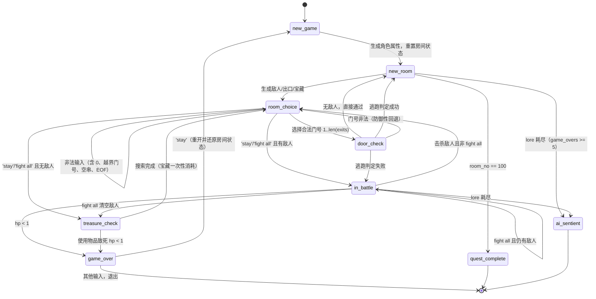

# ONE HUNDRED ROOMS — 状态流转图

游戏由全局变量 `game_state` 驱动，主循环 `main()` 按状态分发到对应函数。
每个函数执行完后写回下一个合法 `game_state`。

## 状态机



## 纯文本版

```
 TITLE ──> NEW_GAME ──> NEW_ROOM ──> ROOM_CHOICE ─┬─ '1'..'N' ─> DOOR_CHECK ─┬─ 成功 ─> NEW_ROOM
    ▲                  │    ▲                     │                          └─ 失败 ─> IN_BATTLE
    │                  │    │                     ├─ stay/fight all ─> IN_BATTLE ─┬─ 胜利 ─> ROOM_CHOICE
    │                  │    │                     │                               ├─ 清场 ─> TREASURE_CHECK
    │                  │    │                     │                               └─ 死亡 ─> GAME_OVER
    │                  │    │                     └─ stay(无敌人) ─> TREASURE_CHECK ─> ROOM_CHOICE
    │                  │    │                              │
    │                  │    └──────── 任意非法输入 ─────────┘ (回到 ROOM_CHOICE，不崩溃)
    │                  │
    │                  └─ room_no == 100 ─> "100 ROOM PASSED" ─> END
    │
    └── GAME_OVER ── 'stay' ──> NEW_GAME（重置房间状态）
                  └─ 其他 ──> "IT ENDS HERE" ─> END
```

## 关键不变量（修复后）

- 门号必须满足 `1 <= choice <= len(exits)`，否则留在 `room_choice`，杜绝重复/越界进门。
- 先攻平局重掷，不会直接判负。
- 敌人 `hp` 与 `toughness` 各自独立掷骰，不再互相覆盖。
- 药水/装备使用严格先校验后生效，消耗数量必减一。
- 宝藏搜索一次性：`treasure_checked` 在搜完后立即置位并清空房间宝藏表。
- `new_game` 重置全部房间级全局状态，续档不会继承旧房间。
- `safe_input` 捕获 EOF/键盘中断，任何异常输入都回到合法房间状态而非崩溃。
